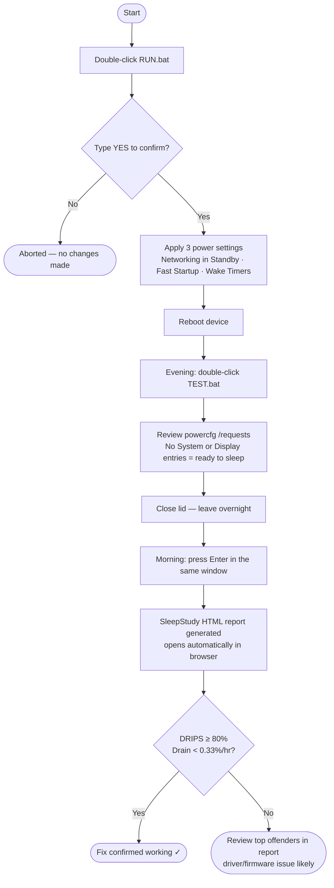

# Fix-ModernStandby

<!-- BADGES:START -->
[](LICENSE) [](https://learn.microsoft.com/en-us/powershell/) [](https://www.microsoft.com/windows) [](https://github.com/5a9awneh/Fix-ModernStandby/commits/master) [](https://github.com/5a9awneh/Fix-ModernStandby)
<!-- BADGES:END -->

Fixes excessive battery drain during Modern Standby (S0) on Windows 11 laptops. Disables the three root-cause settings responsible for the device staying active instead of entering a low-power state when the lid is closed. Includes a two-stage diagnostic tool to verify the fix overnight.

Tested on Lenovo ThinkPad P16s Gen 3 (Windows 11). Applicable to any Modern Standby-capable laptop exhibiting the same behaviour.

**`powercfg /requests` — before fix *(representative)* — device stays active during standby:**

```
DISPLAY:
[SERVICE] Windows Push Notifications System Service

SYSTEM:
[SERVICE] Connected Standby (svchost.exe - NcbService)

AWAYMODE:
None.

EXECUTION:
[PROCESS] svchost.exe (TimeBrokerSvc)

PERFBOOST:
None.

ACTIVELOCKSCREEN:
None.
```

**`powercfg /requests` — after fix + reboot — device ready to sleep:**

```
DISPLAY:
None.

SYSTEM:
None.

AWAYMODE:
None.

EXECUTION:
None.

PERFBOOST:
None.

ACTIVELOCKSCREEN:
None.
```



---

## ⚙️ Requirements

- Windows 10 / 11
- PowerShell 5.1 (built-in)
- Administrator rights (handled by `RUN.bat` and `TEST.bat`)

---

## 🚀 Usage

### Step 1 — Apply the fix

1. Double-click **`RUN.bat`** — UAC elevation is handled automatically
2. Type **`YES`** and press Enter to apply
3. **Reboot the device** — required for the Fast Startup change to take effect

### Step 2 — Verify overnight (optional but recommended)

1. The evening after rebooting, double-click **`TEST.bat`**
2. Review the active power requests shown — no `[System]` or `[Display]` entries means the device is ready to sleep correctly
3. Close the lid and leave the device overnight
4. The next morning, wake the device — the same console window will be waiting
5. Press **Enter** to generate the SleepStudy HTML report
6. The report opens automatically in your browser

---

## 🔧 How It Works

Three power settings are changed via `reg add` and `powercfg`:

| Setting | Registry / powercfg key | Value set |
|---------|------------------------|-----------|
| Networking Connectivity in Standby | `238C9FA8-...\f15576e8-...` (AC + DC) | `0` (Disabled) |
| Fast Startup | `HKLM\...\Session Manager\Power\HiberbootEnabled` | `0` (Disabled) |
| Allow Wake Timers | `SUB_SLEEP RTCWAKE` (AC + DC) | `0` (Disabled) |

**Why these three?**

- **Networking in Standby** — keeps the NIC active to poll for updates, preventing a true low-power state
- **Fast Startup** — hybrid shutdown mode that can interfere with clean sleep/wake cycles
- **Wake Timers** — scheduled tasks and system events that wake the device in the background

The diagnostic tool (`Test-StandbyBehavior.ps1`) uses `powercfg /requests` to show what is blocking sleep entry, then `powercfg /sleepstudy` the next morning to generate an HTML report with DRIPS %, drain rate per hour, and a ranked list of top power consumers.

---

## ⚠️ Warnings & Limitations

- **Reboot required** — the Fast Startup change does not take effect until the device is restarted
- **Modern Standby devices only** — this fix targets S0 (Modern Standby). Devices using S3 sleep do not have the Networking in Standby or Wake Timers settings in the same form
- **Does not fix hardware faults** — if battery drain continues after applying this fix, the root cause may be a driver or firmware issue; check for BIOS and chipset driver updates
- **Emergency reset** — if the device becomes unresponsive with a blinking power LED after a full battery drain, there is a reset pinhole on the bottom cover. Insert a straightened paperclip and hold for 10–15 seconds to reset the Embedded Controller without disassembly
